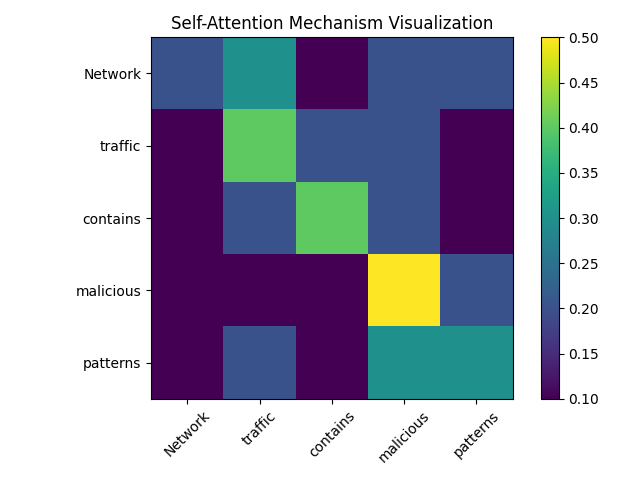
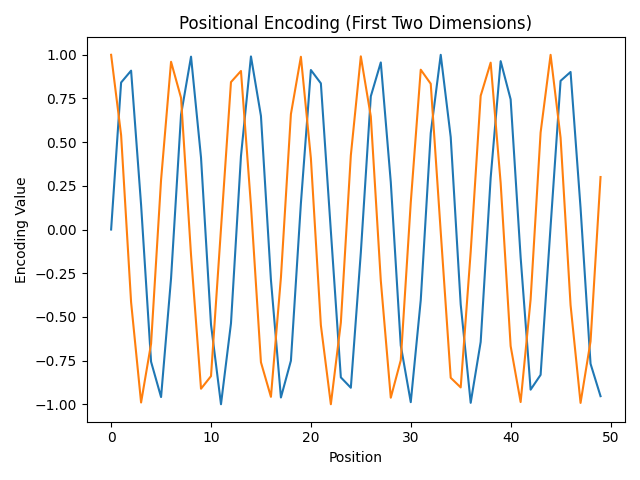

# Transformer Network

## Understanding the Transformer Model

The Transformer is a deep learning architecture that was introduced to handle sequential data such as text. Unlike older models like RNNs or LSTMs, Transformers do not process data step by step. Instead, they look at the entire sequence at once. This makes them faster to train and much better at capturing long-range relationships.

At the core of the Transformer is something called the attention mechanism. Attention allows the model to focus on the most important parts of the input when making a decision. Instead of treating every word or element equally, it learns which parts matter more in a given context.

A Transformer model is mainly built from stacked encoder and decoder layers. Each encoder layer contains a multi-head self-attention mechanism and a feed-forward neural network. The decoder has similar components but also includes attention over the encoder output.

---

## How Attention Works

Attention helps the model decide which words in a sentence are related to each other.

Visual representation of self-attention:



Each row shows how much one word pays attention to the others. Higher values mean stronger relationships.

In practice, attention is computed using Query (Q), Key (K), and Value (V) matrices:

```
Attention(Q, K, V) = softmax(QK^T / sqrt(d_k)) V
```

This formula allows the model to calculate relationships between all elements in the sequence.

---

## Positional Encoding

Because Transformers process all inputs at the same time, they need a way to understand word order. This is done using positional encoding.

Positional encoding adds special patterns to each position in the sequence.

Visual representation of positional encoding:



These values are generated using sine and cosine functions. They allow the model to understand the order of elements without using recurrence.

---

## Transformer Architecture Overview

```
Input Embeddings
        +
Positional Encoding
        ↓
Multi-Head Self-Attention
        ↓
Feed Forward Network
        ↓
Output Representation
```

Multi-head attention means the model runs attention multiple times in parallel, learning different types of relationships.

---

## Application in Cybersecurity

Transformers are extremely powerful in cybersecurity, especially when dealing with sequential data such as logs, network packets, and command sequences.

One important application is intrusion detection. Network traffic can be represented as sequences of events or tokens. A Transformer can analyze these sequences and detect unusual behavior patterns that may indicate attacks.

Another application is phishing detection. Emails can be processed using Transformer-based models like BERT to understand context and detect malicious intent.

Transformers are also used in malware analysis. API call sequences from programs can be treated as text. The model learns normal behavior patterns and identifies anomalies that suggest malicious activity.

Because attention allows the model to focus on important events in long sequences, Transformers are especially effective at detecting advanced persistent threats where harmful behavior is spread across many steps.

---

## Final Thoughts

The Transformer is a modern deep learning architecture built around attention mechanisms. It removes the limitations of sequential processing found in older models and captures long-range dependencies efficiently.

With attention and positional encoding working together, the Transformer understands both relationships and order in data. In cybersecurity, this makes it a powerful tool for intrusion detection, malware classification, phishing detection, and anomaly detection in large-scale systems.

Its ability to process large volumes of sequential data in parallel makes it one of the most important models in modern artificial intelligence.

